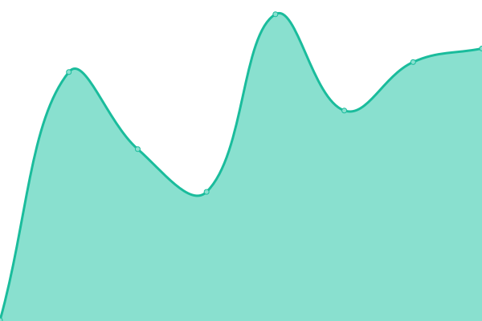
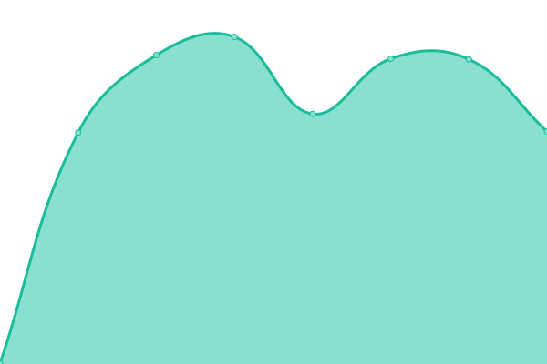
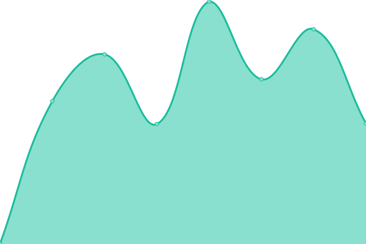

# [📈 Live Status](https://status.pik.farm): <!--live status--> **🟩 All systems operational**

This repository contains the open-source uptime monitor and status page for [Pikfarm](https://status.pik.farm), powered by [Upptime](https://github.com/upptime/upptime).

With [Upptime](https://upptime.js.org), you can get your own unlimited and free uptime monitor and status page, powered entirely by a GitHub repository. We use [Issues](https://github.com/Pikfarm/PikfarmStatus/issues) as incident reports, [Actions](https://github.com/Pikfarm/PikfarmStatus/actions) as uptime monitors, and [Pages](https://status.pik.farm) for the status page.

<!--start: status pages-->
<!-- This summary is generated by Upptime (https://github.com/upptime/upptime) -->
<!-- Do not edit this manually, your changes will be overwritten -->
<!-- prettier-ignore -->
| URL | Status | History | Response Time | Uptime |
| --- | ------ | ------- | ------------- | ------ |
|  [Pikfarm.com](https://www.pikfarm.com) | 🟩 Up | [pikfarm-com.yml](https://github.com/cybertheory/PikfarmStatus/commits/HEAD/history/pikfarm-com.yml) | 

 358ms
     
 | 

<a href="https://status.pik.farm/history/pikfarm-com">100.00%</a>
    

|  [Pik.farm](https://pik.farm) | 🟩 Up | [pik-farm.yml](https://github.com/cybertheory/PikfarmStatus/commits/HEAD/history/pik-farm.yml) | 

 527ms
     
 | 

<a href="https://status.pik.farm/history/pik-farm">100.00%</a>
    

|  [Newsletter](https://news.pik.farm/sign-up) | 🟩 Up | [newsletter.yml](https://github.com/cybertheory/PikfarmStatus/commits/HEAD/history/newsletter.yml) | 

 1246ms
     
 | 

<a href="https://status.pik.farm/history/newsletter">100.00%</a>
    

|  [Blog](https://blog.pik.farm) | 🟩 Up | [blog.yml](https://github.com/cybertheory/PikfarmStatus/commits/HEAD/history/blog.yml) | 

 526ms
     
 | 

<a href="https://status.pik.farm/history/blog">5.55%</a>
    

<!--end: status pages-->

[**Visit our status website →**](https://status.pik.farm)

## 📄 License

- Powered by: [Upptime](https://github.com/upptime/upptime)
- Code: [MIT](./LICENSE) © [Pikfarm](https://status.pik.farm)
- Data in the `./history` directory: [Open Database License](https://opendatacommons.org/licenses/odbl/1-0/)
