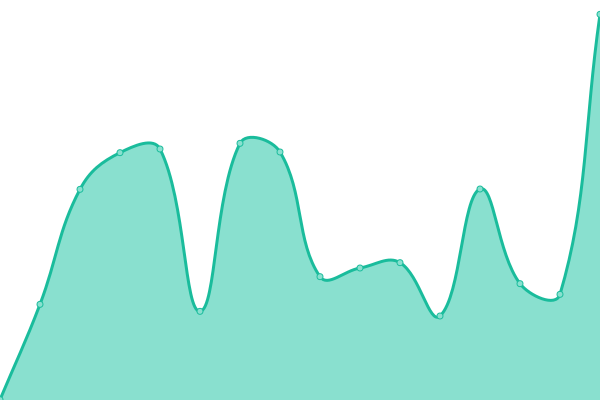

# [📈 Live Status](https://status.pik.farm): <!--live status--> **🟧 Partial outage**

This repository contains the open-source uptime monitor and status page for [Pikfarm](https://status.pik.farm), powered by [Upptime](https://github.com/upptime/upptime).

With [Upptime](https://upptime.js.org), you can get your own unlimited and free uptime monitor and status page, powered entirely by a GitHub repository. We use [Issues](https://github.com/Pikfarm/PikfarmStatus/issues) as incident reports, [Actions](https://github.com/Pikfarm/PikfarmStatus/actions) as uptime monitors, and [Pages](https://status.pik.farm) for the status page.

<!--start: status pages-->
<!-- This summary is generated by Upptime (https://github.com/upptime/upptime) -->
<!-- Do not edit this manually, your changes will be overwritten -->
<!-- prettier-ignore -->
| URL | Status | History | Response Time | Uptime |
| --- | ------ | ------- | ------------- | ------ |
|  [www.pikfarm.com](https://www.pikfarm.com) | 🟩 Up | [www-pikfarm-com.yml](https://github.com/pikfarm/PikfarmStatus/commits/HEAD/history/www-pikfarm-com.yml) | 

 363ms
     
 | 

<a href="https://status.pik.farm/history/www-pikfarm-com">75.12%</a>
    

|  [www.pik.farm](https://pik.farm) | 🟩 Up | [www-pik-farm.yml](https://github.com/pikfarm/PikfarmStatus/commits/HEAD/history/www-pik-farm.yml) | 

 595ms
     
 | 

<a href="https://status.pik.farm/history/www-pik-farm">80.14%</a>
    

|  [Newsletter URL](https://news.pik.farm/sign-up) | 🟥 Down | [newsletter-url.yml](https://github.com/pikfarm/PikfarmStatus/commits/HEAD/history/newsletter-url.yml) | 

 524ms
     
 | 

<a href="https://status.pik.farm/history/newsletter-url">28.02%</a>
    

|  [Blog URL](http://blog.pik.farm) | 🟩 Up | [blog-url.yml](https://github.com/pikfarm/PikfarmStatus/commits/HEAD/history/blog-url.yml) | 

 435ms
     
 | 

<a href="https://status.pik.farm/history/blog-url">81.01%</a>
    

|  Stripe Test Endpoint URL | 🟥 Down | [stripe-test-endpoint-url.yml](https://github.com/pikfarm/PikfarmStatus/commits/HEAD/history/stripe-test-endpoint-url.yml) | 

 292ms
     
 | 

<a href="https://status.pik.farm/history/stripe-test-endpoint-url">79.22%</a>
    

|  Stripe Endpoint URL | 🟩 Up | [stripe-endpoint-url.yml](https://github.com/pikfarm/PikfarmStatus/commits/HEAD/history/stripe-endpoint-url.yml) | 

 283ms
     
 | 

<a href="https://status.pik.farm/history/stripe-endpoint-url">81.22%</a>
    

|  Stripe Webhook URL (Test and Live) | 🟥 Down | [stripe-webhook-url-test-and-live.yml](https://github.com/pikfarm/PikfarmStatus/commits/HEAD/history/stripe-webhook-url-test-and-live.yml) | 

 291ms
     
 | 

<a href="https://status.pik.farm/history/stripe-webhook-url-test-and-live">82.13%</a>
    

<!--end: status pages-->

[**Visit our status website →**](https://status.pik.farm)

## 📄 License

- Powered by: [Upptime](https://github.com/upptime/upptime)
- Code: [MIT](./LICENSE) © [Pikfarm](https://status.pik.farm)
- Data in the `./history` directory: [Open Database License](https://opendatacommons.org/licenses/odbl/1-0/)
